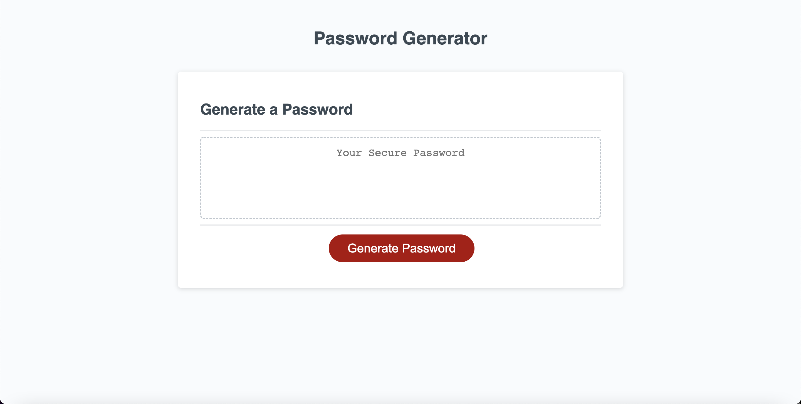

# Random-Password-Generator

### By _**{Miles Fonua}**_

###DEPLOYMENT

 _{The Random Password Generator give the user choices starting with 8-128 characters. Next the user picks from a set of 4 prompts if the user wants to pick and/or Upper Case Letter, Lower Case Letter, Special Character and Numbers included in their randomly set password.}_

Link to Page:

https://mffonua.github.io/Random-Password-Generator/

 

## Technologies Used

* _My apple-mac laptop_

## How to Install

_{To install in user must have access to internet, and click on web-browser available on users device. User must type in url mffonua.github.io/Random-Password-Generator; User is then led to the random password generator and is able to use the website.}_

## Known Bugs

* __when selecting lettering,special charaters, and numbers in the prompts, UpperCase, Special Character, Numbers take priority over LowerCase Letters even though it is selected. Currently working on bug to solve this problem__

Copyright (c) _07/19/2022_ _Miles-Fonua_